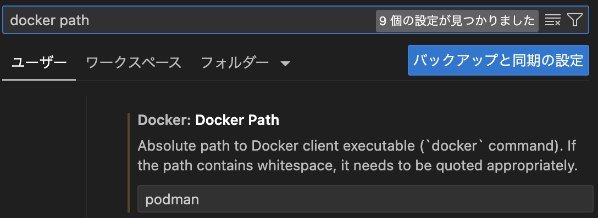
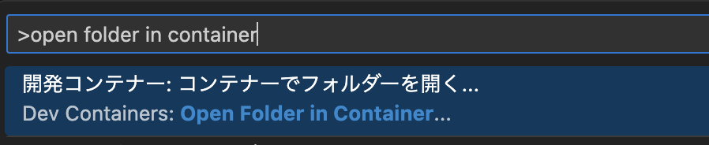
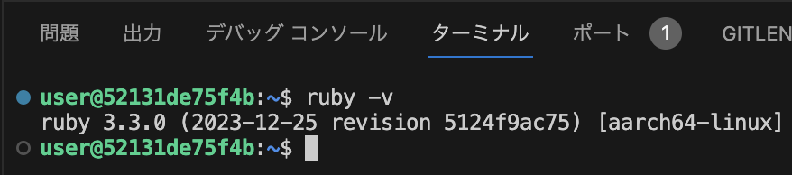
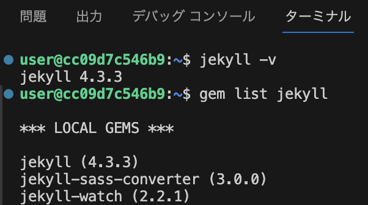

# Jekyll開発環境

[VS Code]の拡張機能[Dev Containers]を使って、コンテナー上に[Jekyll]の開発環境を構築します。

[Jekyll]は、[GitHub Pages]に組み込まれている静的サイトジェネレーターです。MarkdownなどのファイルをGitHubに置くだけでビルドすることなく[GitHub Pages]でWebページとして公開することができます。

## 前提

### 前提ソフトウェア

利用する環境には、[VS Code]および[docker]または[podman]が導入されている必要があります。また、VS Codeには拡張機能[Dev Containers]のインストールが必要です。

このリポジトリのJekyll開発環境は以下を使用して稼働確認を行いました。

- VS Code 1.87.1 (Universal)
- Dev Containers v0.348.0
- Podman Desktop 1.7.1
- Podman 4.9.3

### コンテナーとGitHubの連係

GitHubのリポジトリとコンテナー上のローカル・リポジトリを連係させるためにはコンテナーのホストにあるGitHubの資格情報(SSHのキー)を共有する必要があります。以下のサイトに資格情報の共有方法について記載されています。

[Visual Studio CodeのRemote ContainersからもGitを使う方法](https://okash1n.works/posts/how-to-use-git-inside-vscode-dev-container/)

## 使用方法

### Dev Containersの設定

このリポジトリを適切なフォルダーにクローンするか、ダウンロードしてください。

隠しフォルダーとして`.devcontainer`があります。`.devcontainer`内の`devcontainer.json`が[Dev Containers]の設定ファイルです。[Dev Containers]上で稼働する[VS Code]の拡張機能を追加したい場合など必要に応じて編集してください。特に必要なければそのままでかまいません。

`.devcontainer`内の`Dockerfile`はコンテナーを作成するためのものです。DockerHubからRubyの公式イメージの最新版を取得し、Jekyllを導入するように構成してあります。必要があれば内容を変更してください。

### VS Codeの設定

[podman]を使用している場合は、[VS Code]の設定が必要です。[VS Code]の「設定」を開き、`docker path`で検索してください。下図のように`Dev > Containers: Docker Path`が見つかるので、そのフィールドに`podman`を入力してください。

### 開発コンテナーの起動

VS CodeでF1キーを押してコマンドパレットを開き、`open folder in container`と入力します。「開発コンテナー: コンテナーでフォルダーを開く...」をクリックしてください。

次にフォルダーを選択する画面が表示されるので`.devcontainer`を含むフォルダー、つまり`.devcontainer`の親フォルダーを選択してください。

> [!NOTE]
フォルダーの選択で`.devcontainer`を選択してはなりません。選択するのは`.devcontainer`を含むフォルダー、つまり`.devcontainer`の親フォルダーです。`.devcontainer`は隠しフォルダーなので普通のオペレーションでは表示されません。

VS Codeの画面が新規に起動し、VS Codeの画面右下に「開発コンテナーの開始(ログの表示)」と表示されます。コンテナーのビルドや開発コンテナーのVS Codeへの拡張機能の導入が行われます。初回は数分の時間がかかります。完了すると画面左下に「開発コンテナー: Jekyll開発環境」と表示されます。

> [!NOTE]
> 「開発コンテナー:」に続いて表示される「Jekyll開発環境」は`devcontainer.json`の`name`に設定した値です。

### 開発コンテナーの稼働確認

VS Codeのターミナルを開き、コマンドを入力して[Ruby]と[Jekyll]が導入されたコンテナーが起動していることを確認しましょう。

`ruby -v`を入力して[Ruby]のバージョンが応答されることを確認します。

`jekyll -v`および`gem list jekyll`を入力して[Jekyll]のバージョンが応答されることを確認します。

### Jekyllを使用してサイトを作成する

[Jekyll]を使用して[GitHub Pages]のサイトを作るには以下の[GitHub Pages]の解説を参照してください。

[Jekyll を使用して GitHub Pages サイトを作成する](https://docs.github.com/ja/pages/setting-up-a-github-pages-site-with-jekyll/creating-a-github-pages-site-with-jekyll?platform=linux)

上記のドキュメントを参照して作成してこのリポジトリのgh-pagesブランチに作成したGitHub Pagesは以下のとおりです。

[GitHub Pagesのサンプル](https://ackylarkham.github.io/jekyll-devenv/)

また、[GitHub Pages]のlook&fellを変更するために以下のようなテーマがあります。

[Supported Themes](https://pages.github.com/themes/)

上記のテーマ以外にもテーマが公開されており、例えば[Just the Docs]は、[GitHub Pages]にドキュメンテーションを公開するためのテーマです。

[Jekyll]:https://jekyllrb.com/
[GitHub Pages]: https://docs.github.com/pages
[VS Code]: https://code.visualstudio.com/
[Dev Containers]: https://code.visualstudio.com/docs/devcontainers/containers
[docker]: https://www.docker.com/
[podman]: https://podman.io/
[Ruby]: https://www.ruby-lang.org
[Just the Docs]: (https://github.com/just-the-docs/just-the-docs-template)

